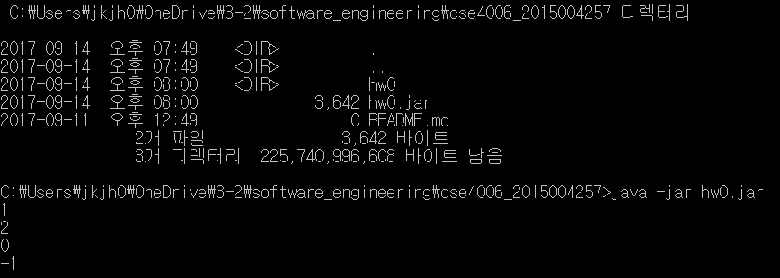

# Homework_1 (Social Network)

주어진 사람들이 Node, 관계가 edge로 주어진 graph를 구성하고,

두 사람이 주어지면 가장 짧은 거리를 구하는 프로그램. BFS 탐색 이용.

프로그램을 구성하는 패키지 명은 cse4006, 클래스는

- Program : 프로그램의 시작지점, main이 이 클래스에 속함.
- FriendGraph : 그래프를 구성하고 주어진 사람 사이의 거리를 구함.
- Person : 사람을 생성함. 이름을 요구.
- Queue : BFS를 위한 자료구조. circular queue로 구현.
- Node : enqueue시 거리를 저장하기 위한 추가적인 자료구조

가 있다.

최대 인원은 50명,

같은 이름을 가진 사람이 들어오는 경우, 기존에 있는 사람으로 판정하여 추가하지 않고,

큐가 가득찬 경우에 enqueue를 하거나 큐가 비어있을 때 dequeue를 하면 exception을 보냅니다.

구글 코딩 컨벤션을 적용하였습니다.

# Result

build.xml을 이용하여 ant build를 하는 경우 build 폴더를 생성하여 내부에 컴파일한 클래스파일들을 저장하고, 프로젝트 루트 폴더에 hw0.jar 파일을 생성합니다. 

첫 시작지점은 cse4006.Program에 있는 main입니다.

실행 시 main에서 getDistance함수를 호출한 결과를 출력합니다. 